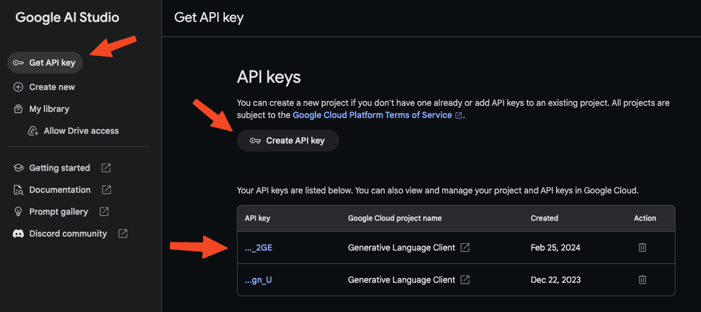

# Working with Gemini API

Right now, inside your `app.ipynb` you should have the following block of code:

```py
import google.generativeai as genai

genai.configure(api_key="")
model = genai.GenerativeModel('gemini-pro')
```

But if you try to run the model, you will receive nothing, that is because you need an `api_key` from Google to allow you to connect to their Gemini LLM. To get your API key, simply go to this [link](https://aistudio.google.com/app) here.

On the left side, you will see a button that said `Get API key`. Click on that.

Then click on the `Create API key`.

Finally copy the API key that is given to you, and paste it in the block of code above.



It should now looks something like this:

```py
import google.generativeai as genai

genai.configure(api_key="Your-api-key-here")
model = genai.GenerativeModel('gemini-pro')
```

## Test run

To make sure that everything is working as intended. Add another block of code in the notebook and paste the following code inside:

```py
response = model.generate_content("Can you say hello?")
print(response.parts)
```

And run this code to see if you can get a response from Gemini.

If you get a response, we have successfully finish all the necessary set-up so that we can build a LLM app. Yayyyy!!!!
