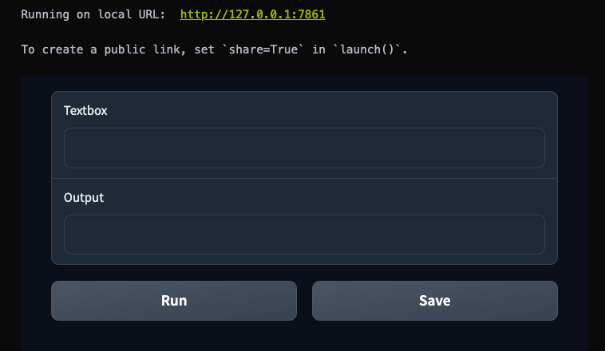

# Building a simple UI with gradio

So we talk about Gradio earlier, and about what it is exactly. Now, we will start to get our hand dirty and see why Gradio is such a cool tool to have as a ML Engineer.

## Starter UI building

Create a new code block, and paste in the following code:

```py
import gradio as gr
```

Create another code block, and paste in:

```py
with gr.Blocks() as demo:
  inp = gr.Textbox(value="")
  out = gr.Textbox(label="Output")
  with gr.Row():
    run_btn = gr.Button("Run")
    save_btn = gr.Button("Save")

demo.launch()
```

Now run both of the code block sequentially. You should see inside your notebook, an interface just appear like so:



Pretty neat ain't it?

In fact, if you click on the local URL indicated above, it should open up a browser window, with the same UI being displayed. Throughout your journey learning about LLMs, you will probably see a lot of these UI everywhere, as it is the most efficient and fastest way to prototype your new ML models and applications.

You can play around with the UI, but right now it doesn''t really do anything. That is because we have not given it the proper functionality yet.

For more information regarding to how to use Gradio, you can visit their [documentation](https://www.gradio.app/docs/interface). But it does require some higher level of understanding of Python to be used effectively. In this workshop, I will show you only some of the more basic stuff to get the ball rolling.

## Adding functionality

Create a new code block, and paste in our email text as follow:

```py
email = """
Subject: Recap of Expenses from Our Recent Party

I hope this email finds you well. I wanted to take a moment to thank you for joining us at the party last week. It was fantastic having you there, and your presence truly added to the fun atmosphere!

I've gone through the expenses from the party, and I wanted to provide you with a breakdown of the costs incurred. Here are the five main items along with their respective costs:

Chips: $20
Coca-cola: $50
Pepsi: $40
Pretzel: $40
Popcorn: $60

Since we both participated in the event, I thought it would be helpful to share these details with you.

If you have any questions or concerns about the expenses, please don't hesitate to reach out. I believe in transparency when it comes to sharing costs, and I want to ensure that everything is clear and accounted for.

Once again, thank you for being a part of the celebration. I had a wonderful time, and I hope you did too!

Looking forward to hearing from you soon.

Best regards,

Alice
"""
```

Add another code block, and now add in the following function that will be used to extract our data:

```py
def extract(inp):
  prompt = f"""
  """

  response = model.generate_content(prompt)
  return response.text
```

And another code block, to add a function to save our data to a local csv file:

```py
def save_to_csv(text):
  filename = "result.csv"
  lines = [line.strip() for line in text.split("\n") if line.strip()]
  with open(filename, 'w') as csvfile:
    for line in lines:
      csvfile.write(line + "\n")
    csvfile.close()
```

These might be a bit confusing right now, but don't worry, I will explain their functionality in the next section. Right now, let's connect all of this functionality to the UI first.

We will create another code block, and insert the following code inside:

```py
with gr.Blocks() as demo:
  inp = gr.Textbox(value=email)
  out = gr.Textbox(label="Output")
  with gr.Row():
    run_btn = gr.Button("Run")
    save_btn = gr.Button("Save")
  run_btn.click(fn=extract, inputs=inp, outputs=out)
  save_btn.click(fn=save_to_csv, inputs=out)
  print(out.value)

demo.launch()
````

Now if we run all of the code block sequentially, we can see our new UI in action. If we click the `Run` button in the UI, we can now actually see the LLM workings, however, it will be speaking gibberish, because we have not tell it how to handle our data yet.

Now, we can move on to the next section.
