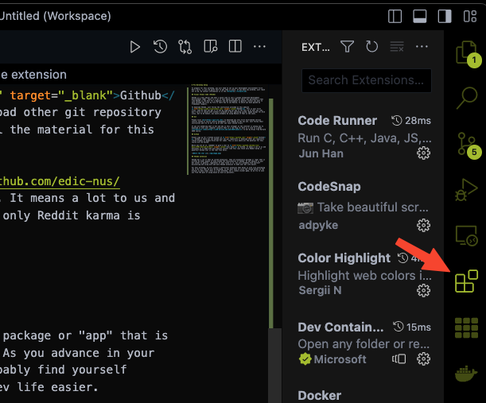

# Pre Workshop Setup

To prepare for this workshop, you will need to set up your development environtment first. Don't worry, it will be quite fast to get them in place. If you have any problem, just reach out to me, my contact information is in the [Foreword](./foreword.md).

## Visual Studio Code (VSCode)

VSCode is a text editor and what I would like to call a pseudo Integrated Development Environtment (IDE). There is a lot of text editor and IDE out there, but personally I feel like VSCode is the best for a beginner (unless you want to walk through the trial by fire to learn how to use Neovim, to which you have gained my tremendous respect).

To download VSCode, just follow the instruction provided on this website
<a href="https://code.visualstudio.com/" target="_blank">VSCode</a>. This is your first trial, show me that you got it in you by figuring out how to set this up on your own (LOL, don't worry it should work without a problem on most operating system, maybe except for Arch Linux, but to be honest, you would probably be using Neovim if that is the case).

## VSCode Extensions

VSCode has a lot of what we called **Extensions**. They are essentially package or "app" that is written by other people to help extend the functionality of VSCode. As you advance in your dev career in general, regardless of what field is it, you will probably find yourself discovering and using more and more VSCode extension to make your dev life easier.

For this workshop, we will need the Jupyter extension to help set up our development environtment nicely.

Click on the extensions Icon as shown above.

Type in the Search Extensions section: **Jupyter**

Open up the results that say:

> Jupyter
>
> Microsoft

Just click the **Install** button and you are set.

## Git

Please visit [Git](https://git-scm.com/) to download you very first distributed version control system or source control management (scm) depend on who you ask. Just follow their instruction and try to set it up on your own (your second trial).

If you are wondering what is Git and why is this stranger on the internet is asking you to download it onto your computer (usually that is a red flag 🚩) here is a link to a great [introductory video](https://cs50.harvard.edu/web/2020/weeks/1/) to Git by Brian from Harvard CS50 course.

## Github

Please sign up for a Github account at <a href="https://github.com/" target="_blank">Github</a>. Github is where you can upload your own git repository or download other git repository(think dropbox or Google Drive but for code). This is also where all the material for this course will be hosted.
